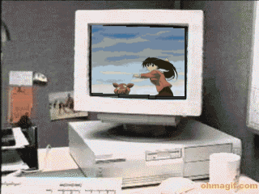

  

  <code>Peng · 21 · Semester 7 · Universitas Terbuka</code>
   
  <code>Portrait of my future within schizo : este sí da miedo 💀</code>

  

  <code>no deal, innit?</code> 🗿 <code>literal.</code>

---

### 📚 Learning

  <code>C</code> &nbsp;&nbsp; ███░░░░░░░ &nbsp;&nbsp; 3% 
  <code>C++</code> &nbsp; ███░░░░░░░ &nbsp;&nbsp; 3% 
  <code>Assembly</code> &nbsp; ██░░░░░░░░ &nbsp;&nbsp; 2% 
  <code>VHDL</code> &nbsp;&nbsp; ██░░░░░░░░ &nbsp;&nbsp; 2% 
  <code>PostgreSQL</code> &nbsp; ██░░░░░░░░ &nbsp;&nbsp; 2%

  <code>Progress detected. Skill not found.</code> 💀 <code>cero chill.</code>

---

<table width="100%">
<tr>

<td width="33%" align="center" valign="top">

### 💻 Languages

<code>still learning, pero literal.</code>

</td>

<td width="44%" align="center" valign="top">

### 🛠️ Tools

<code>still tweaking, según yo.</code> 🗿

</td>

<td width="23%" align="center" valign="top">

### 🗄️ Database

<code>One more query, y ya.</code> 💀

</td>

</tr>
</table>

---

  <strong><code>After all that debugging...</code></strong>
   
  <code>It was one typo.</code> 💀
   
  <code>qué random.</code>

  

---

  <strong><code>After hours of suffering...</code></strong>
   
  <code>That was the problem?</code> 🗿
   
  <code>no puede ser.</code>

  

---

  <strong><code>Me: AI, give me the full code.</code></strong>
   
  <code>AI: Not yet.</code>
   
  <code>qué pereza.</code>

  

  <strong><code>Me: I WANT IT NOW.</code> 💀</strong>
   
  <code>cero chill.</code>

---

  <strong><code>AI: another update.</code></strong>
   
  <code>Me: still loading.</code> 💀
   
  <code>está cursed.</code>

  

---

  <strong><code>Me: can you make me smarter?</code></strong>
   
  <code>AI: Keep dreaming.</code> 🗿
   
  <code>literal, sigue soñando.</code>

  

---

  <strong><code>When I cheat on my darling Linux...</code></strong>
   
  <code>Linux: “We're getting a divorce.”</code> 💀
   
  <code>ya valió.</code>

  

---

  

  <strong><code>Semester 7.</code></strong>
   
  <code>Thinking about what to think about.</code> 🗿
   
  <code>qué rayos.</code>

