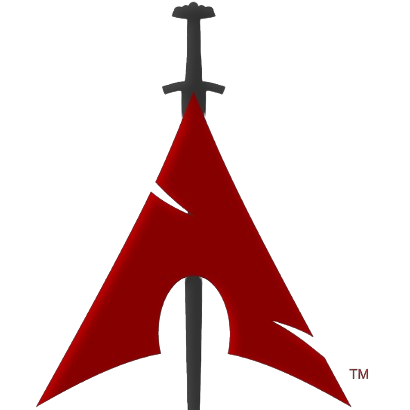

  

  
    <code>Young Man's within Peng</code>
  
   
  
    <code>Semester 7 · Information Systems · Universitas Terbuka</code>
  
   
  
    <code>Low-Level Systems · Reverse Engineering · Computer Architecture · Machine Learning · Computer-Using Agents</code>
  

  

---

## About Me

I am an Information Systems student interested in understanding computing from the system level upwards, with a particular focus on **low-level computing, Linux, computer architecture, hardware, security, and artificial intelligence**.

My current interests include **C, C++, Assembly, Bash, Lua, and Python**, with an emphasis on understanding memory, processes, system calls, operating-system interfaces, debugging, and how software interacts with the underlying machine.

I am also exploring **digital logic, VHDL, SystemVerilog, and computer architecture** to understand how computation is represented and implemented at the hardware level, and how hardware and software interact across different abstraction layers.

In security, I am interested in **reverse engineering, binary analysis, debugging, low-level security, and network security**. I use tools such as **GDB and radare2** to study program execution, binaries, memory, and system behaviour.

Alongside systems and security, I explore **machine learning, computer vision, and Computer-Using Agents (CUAs)**, particularly how intelligent systems perceive, interact with, and operate within real computing environments.

My broader goal is to understand the relationship between **software, operating systems, computer architecture, hardware, security, and artificial intelligence** rather than treating each area as an isolated field.

---

## 🧠 Technical Scope

<table width="100%">
<tr>

<td width="25%" align="center" valign="top">

### ⚙️ Systems

**C · C++ · Assembly · Bash · Lua · Linux**

Systems programming, memory, processes, system calls, operating-system interfaces, debugging, and automation.

</td>

<td width="25%" align="center" valign="top">

### 🔩 Hardware

**Digital Logic · VHDL · SystemVerilog**

Digital logic, computer architecture, processor concepts, hardware description, and hardware-software interaction.

</td>

<td width="25%" align="center" valign="top">

### 🛡️ Security

**Reverse Engineering · Binary Analysis · Debugging**

Program analysis, binary behaviour, debugging, low-level security concepts, and network security.

</td>

<td width="25%" align="center" valign="top">

### 🤖 AI & Vision

**Python · OpenCV · Machine Learning · CUA**

Computer vision, machine learning, intelligent agents, computer interaction, and environment-aware AI.

</td>

</tr>
</table>

  
    <code>Systems · Architecture · Hardware · Security · Machine Learning · Computer Vision · CUA</code>
  

  
    <code>Systems · Architecture · Hardware · Security · Machine Learning · Computer Vision · CUA</code>
  

  

  
    <code>When the abstraction stops being enough, go one layer deeper.</code>
  

---

## 💻 Languages & Data

  
    <code>C · C++ · Python · Lua · Bash · PostgreSQL · Zig · Assembly · VHDL · SystemVerilog</code>
  

---

## 🛠️ Tools & Environment

  
    <code>BlackArch Linux · bspwm · Neovim · Git · GitHub · CMake · Docker · OpenCV · tmux · Kitty</code>
  

---

  

  
    <code>When new models keep getting better while I am still figuring out what the previous model actually did.</code>
  

---

  

  
    <code>When the bug finally explains itself.</code>
  

